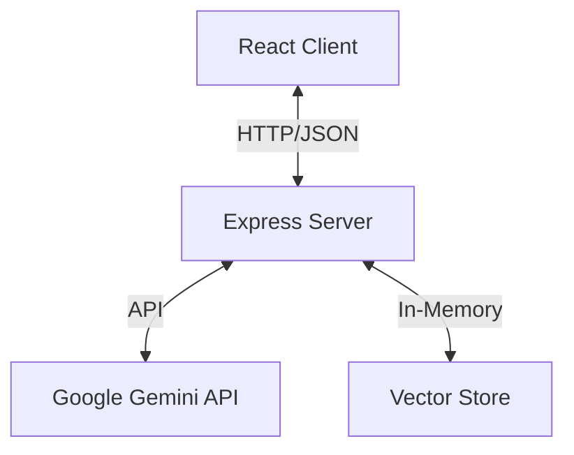

# Architecture Documentation

## Overview
The Resume Screening Tool is a full-stack web application designed to analyze resumes against job descriptions using Generative AI. It features a React-based frontend and a Node.js/Express backend, leveraging Google's Gemini models for intelligence.

## System Design

### High-Level Architecture

### Tech Stack
- **Frontend**: React, TypeScript, Vite, Framer Motion (animations), Lucide React (icons).
- **Backend**: Node.js, Express, TypeScript, Multer (file handling).
- **AI/ML**: Google Gemini (Embeddings & Chat), LangChain concepts (RAG).
- **Storage**: In-memory vector store (for simplicity in this demo version).

## Components

### Frontend (`client/`)
The frontend is built with React and focuses on a clean, modern user experience.
- **`App.tsx`**: Main application controller. Manages state for analysis data and view switching.
- **`components/UploadSection.tsx`**: Handles file drag-and-drop for Resumes and Job Descriptions.
- **`components/AnalysisDashboard.tsx`**: Displays the analysis results (Match Score, Strengths, Gaps) with visual indicators.
- **`components/ChatInterface.tsx`**: Provides a chat interface for users to ask questions about the candidate, powered by RAG.
- **`api.ts`**: Centralized API service for communicating with the backend.

### Backend (`server/`)
The backend handles file processing, AI interactions, and state management.
- **`routes/api.ts`**: Defines REST endpoints:
    - `POST /upload`: Accepts files, parses them, generates embeddings, and returns an initial analysis.
    - `POST /chat`: Handles follow-up questions using RAG.
- **`services/parser.ts`**: Extracts text from PDF and TXT files.
- **`services/llm.ts`**: Interface for Google Gemini API (Embeddings and Generation).
- **`services/vectorStore.ts`**: A simple in-memory vector database to store resume chunks and their embeddings for RAG.

## Data Flow

### 1. Analysis Flow
1.  User uploads Resume (PDF/TXT) and Job Description (PDF/TXT).
2.  Server parses text from both files.
3.  Server chunks the Resume text and generates embeddings using `text-embedding-004`.
4.  Chunks are stored in the in-memory Vector Store.
5.  Server sends the full (or truncated) text of both documents to Gemini (`gemini-2.0-flash`) with a prompt to analyze the match.
6.  Gemini returns a JSON object with Score, Strengths, Gaps, and Summary.
7.  Server responds to Client with this data.

### 2. RAG Chat Flow
1.  User asks a question via the Chat Interface.
2.  Server generates an embedding for the question.
3.  Server searches the Vector Store for the most relevant resume chunks (Semantic Search).
4.  Server constructs a prompt containing the relevant context and the user's question.
5.  Gemini answers the question based *only* on the provided context.
6.  Answer is returned to the Client.

## Future Improvements
-   **Persistent Database**: Replace in-memory store with a vector database like Pinecone or pgvector.
-   **Session Management**: Support multiple concurrent users/sessions.
-   **Authentication**: Secure the application.
-   **History**: Save past analyses.
